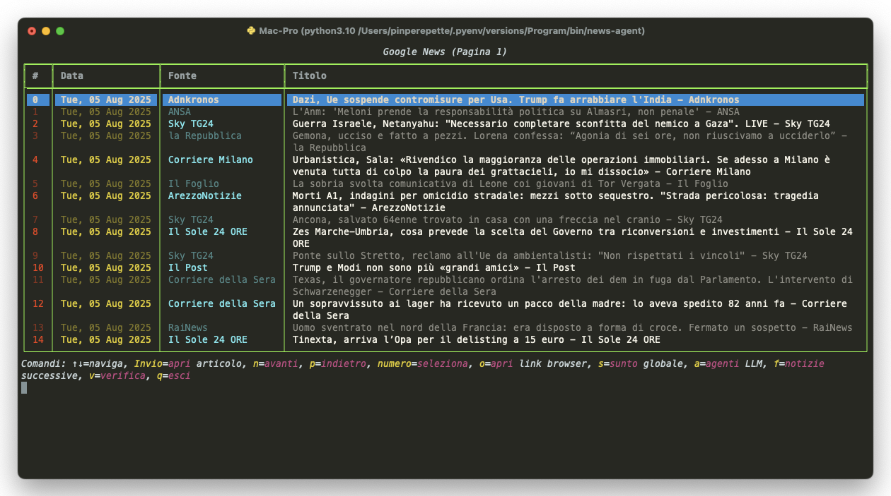
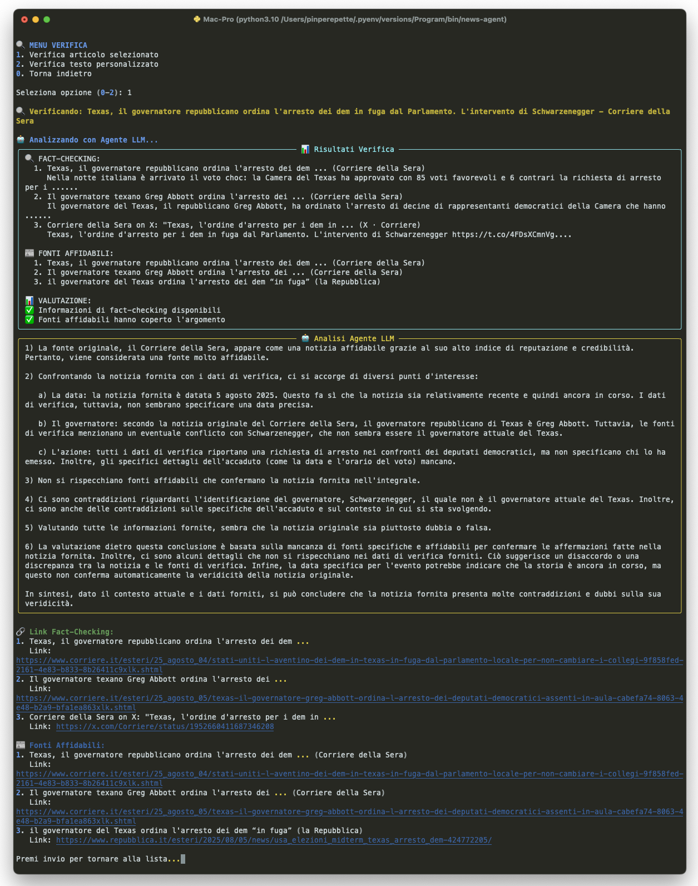

# Terminal News Agent

**Terminal News Agent** is the ultimate tool for reading, analyzing, and “dissecting” Google News headlines directly from your terminal.  
Not only can you browse the latest news, but you can launch **multiple local LLM agents** (via Ollama) to generate summaries, analyze implications, and build complex scenarios—all without a browser and with total privacy.

---

## 🚀 Features

- **Real news from Google News** in real-time (via RSS, no sketchy scraping)
- **Interactive terminal table** with keyboard navigation, Rich styling, and focus highlight
- **Global news summary** (one click, LLM-powered via Ollama)
- **Chained LLM agents:**
  - *Summary Agent*: concise, factual abstract
  - *Implications Agent*: in-depth analysis of consequences
  - *Theory Agent*: connects dots and builds scenarios
  - *(All agents can be triggered from the terminal UI!)*
- **Open article in browser** with one key
- **Multi-language** and Google News topic filtering (configurable in settings)
- **No cloud required:**
  - 100% local processing, no external APIs needed
  - Ollama support out-of-the-box, just install and run
- **Designed for hacking/extending:** config/code separation, easy to customize
- **Works on Linux, macOS, WSL, Windows Terminal**

---




---

## ⚡ Installation

Clone the repo and install locally:

```bash
git clone https://github.com/your-user/news_agent.git
cd news_agent
pip install .
